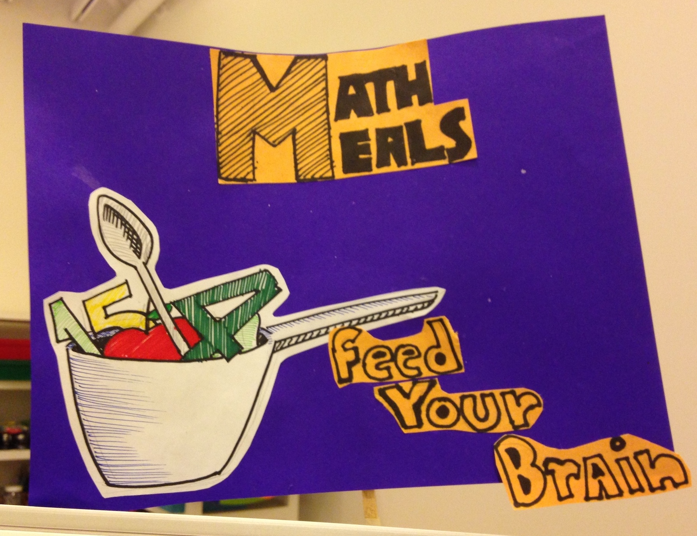

## Objective
In 2015-2017, the Mexican government implemented a pilot program in which over one million laptops and tablets were handed out to children in primary schools across six states. This created a demand for new learning software tailored to the needs of teachers and students in this particular context and aligned with specific learning goals in the Mexican primary curriculum. In March 2016, I participated as an educational consultant in a week-long workshop organised by the British Council Mexico and Laboratorio para la Ciudad in Mexico City. The objective was to bring together educational researchers from the UK and primary school teachers and games designers from all over Mexico to collaborate in developing ideas for mobile applications to integrate the teaching of Mathematics and English in Mexican primary classrooms. 

--- 

## Methods
The first part of the workshop was dedicated to creative idea finding activities, which allowed all participants to get to know each other and engage with the subjects of Maths and English teaching in playful ways, including through visualisation and word association games. These activities helped us to articulate our preconceptions about teaching and learning and brainstorm ideas about how to creatively engage kids with mathematical concepts. 

Next, we conducted an analysis of the curriculum learning goals and the teachers' own classroom experiences. This revealed that the biggest need was for apps that could support the learning of multiplication and division, fractions and decimals, metric systems, and geometric shapes, as well as basic English words and constructions related to children's everyday activities at home and in school. At the same time, we created a list of essential app features for use in Mexican primary school classrooms. This included, for example, a fully functional offline mode, or the ability to use Bluetooth instead of WiFi to connect students' and teachers' devices, since many school across Mexico have limited, or very unstable Internet access. Finally, we matched up the learning goals we had identified with our initial ideas for playful ways of engaging children through technology, and got into small groups to further develop our app ideas. 

---

## Outcomes
The team I was a part of focused on developing our idea for an app called Math Meals, a cooking game designed to help children learn about fractions and decimals, as well as food-related vocabulary in English. Together, we mapped out the different app components in terms of (student and teacher) user journeys and planned various lesson blocks corresponding directly to specific curriculum learning goals (see photos above). We used wireframes and simple pen-and-paper design elements to visualise and present our app idea to representatives from the Mexican Ministry of Education and the British Council at the end of the workshop. 

The committee selected Math Meals as one of the three most promising apps to emerge from the workshop. Therefore, the idea was taken forward to a team of software developers who created a functioning prototype of the app for user testing in primary classrooms and further development by the British Council in Mexico. 