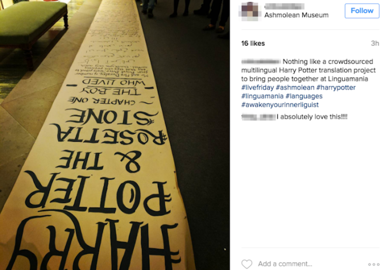

## Objective
On January 27th, 2017, Creative Multilingualism and the Ashmolean Museum in Oxford hosted the *LinguaMania LiveFriday*, an evening of events, experiments and performances to engage with languages in novel and creative ways. With *Harry Potter and the Rosetta Stone*, our goal was to showcase and celebrate the wealth of languages spoken in the Oxford City community.

--- 

## Methods
Together with a team of student volunteers, we oversaw the creation of a multilingual translation of the first chapter of Harry Potter and the Philosopher's Stone. The museum visitors were invited to translate sentences from the English book into whatever languages they knew and to write them on a large paper scroll laid out in the sculpture gallery. Towards the end of the evening, the scroll was ceremonially unfurled across the multi-storied atrium at the heart of the Ashmolean Museum, where it became the centerpiece to a multilingual performance. Speakers of a variety of languages, both classical and contemporary, read passages from the text, allowing visitors not only to see but also hear the wealth of languages spoken in their community.

---

## Outcomes
Throughout the evening, the paper scroll was filled with more than 100 sentences in 51 different languages, ranging from Arabic, Armenian, and Bengali to Swahili and Welsh. Two young Fantasy and Science Fiction fans even came prepared with translations in Elvish and Circular Gallifreyan!

The installation was among the most popular attractions of the LinguaMania LiveFriday event, with many visitors queuing to showcase their linguistic talents and sharing our contributions on social media (see below) and in blog posts and newspaper articles about the event. The scroll was subsequently donated to the University of Oxford and featured in an exhibition at the Bodleian Library in 2018.

