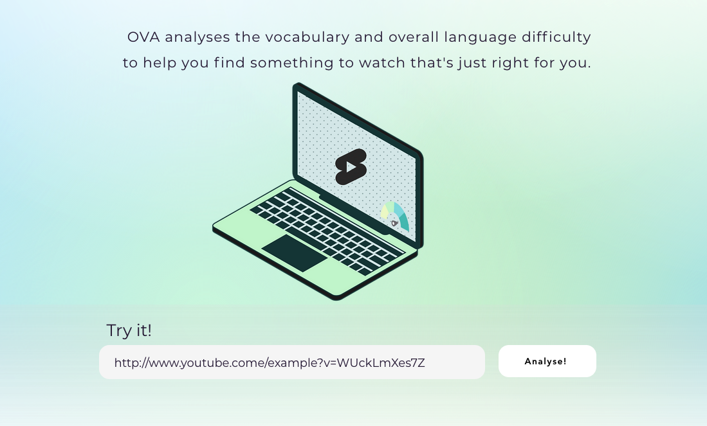
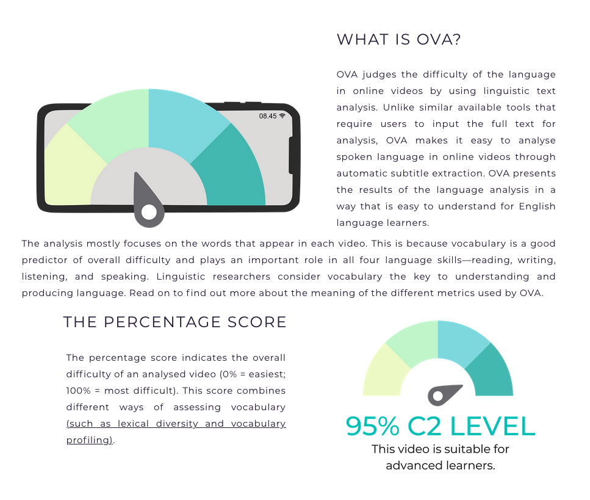

## Objective
This project explored the development of an Online Video Analyser (**OVA**), designed to support English language learners in finding informal video resources which are both interesting and linguistically accessible to them.

Research indicates that many successful learners of English as a foreign language frequently engage with English-language TV series and films, online videos, and other web content in their leisure time. Less proficient learners, on the other hand, are often do not make similar use of informal resources for language learning because they have difficulty identifying content that is both at an appropriate linguistic level and aligns with their personal interests. The idea behind OVA is to enable these learners to be more independent by helping them evaluate the linguistic difficulty of videos that interest them.

--- 

## Outcomes
I was able to conduct extensive idea development work, to design a website which shows off the idea behind OVA and the intended design, as well as a low-functioning prototype in Python which demonstrates the viability of the analytical approach. These prototypes will serve in any future project stages to explain the purpose of the tool, how it is intended to function, and how the results can be interpreted to potential collaborators and investors. 

